<div align="center">


</div>

# Retrek

Retrek is an autonomous AI revenue recovery engine for failed payments, checkout drop-offs, subscription failures, B2B receivables, mandate retries, voice recovery, and promise-to-pay follow-ups.

The app detects failed transactions, diagnoses the likely failure reason with an LLM, applies deterministic recovery rules, creates bounded Razorpay test payment links where allowed, routes risky cases to human approval, and records every decision in Supabase for auditability.

## What It Does

- **Multi-Source Ingestion:** Ingests failed transactions from live Razorpay `payment.failed` webhooks, CSV batches, or manual entries.
- **ISO-8583 Banking Ontology:** Maps 16 gateway decline codes into standard international banking failure categories.
- **Dynamic Actuarial AI:** Uses Groq (`qwen/qwen3.6-27b`) to evaluate root cause and calculate dynamic recovery probability combining Base ISO risk, customer loyalty history (+3%/order), retry fatigue (-15%/attempt), and ticket size.
- **3-Gate Deterministic Policy Engine:** Strict guardrails enforce auto-execution (<₹10k, ≥65% viability), human swipe approval, or stop rules (fraud, max retries, customer fatigue).
- **Razorpay Order Execution:** Creates Razorpay payment orders with bounded idempotency locks.
- **Live Webhook Confirmation:** Catches payment success and failure callbacks with HMAC SHA-256 verification to update recovery status in real time.
- **Real-Time Dashboards:** Protected interfaces for transaction management, ROI metrics, immutable audit trail, automated 5-pillar benchmark, and recovery tracking.
- **Supabase Realtime:** Instant live WebSocket state synchronization across all connected clients.

## System Architecture

```mermaid
%%{init: {'flowchart': {'nodeSpacing': 25, 'rankSpacing': 70, 'curve': 'basis'}}}%%
flowchart TD
    subgraph INGEST["1. Ingestion Layer"]
        W1["Live Razorpay Webhook<br/>payment.failed, link.expired<br/>Auto-triggers recovery pipeline"]
        W2["Batch Dataset Ingest<br/>20 Scenarios, 7 Types<br/>POST /api/transactions/seed"]
        W3["Manual / API Ingest<br/>POST /api/transactions/ingest<br/>Custom decline codes, amounts"]
    end

    subgraph DIAGNOSE["2. Cognitive AI Diagnosis Engine"]
        ISO["ISO-8583 Banking Ontology<br/>16 Decline Codes, 4 Categories<br/>Technical / Financial / Customer / Fraud"]
        ACT["Dynamic Actuarial Model<br/>Base + Loyalty +3%/order<br/>Retry -15%/attempt, Ticket +/-5-10%"]
        LLM["Groq LPU Inference<br/>qwen/qwen3.6-27b, temp 0.2<br/>JSON Mode, actuarial weights"]
        OUT["Empathetic Message Generation<br/>Hinglish + English Dual Output<br/>Voice Call Scripts for Support"]
    end

    subgraph POLICY["3. Deterministic 3-Gate Policy Engine"]
        G1["Gate 1: AUTO_EXECUTE<br/>Recovery >= 65%, Ticket < 10k<br/>Retries within safe limit"]
        G2["Gate 2: HUMAN_APPROVAL<br/>Recovery 50-64%, Ticket >= 10k<br/>Requires merchant swipe"]
        G3["Gate 3: STOP_RULE<br/>Fraud / Stolen Card, Max Retries<br/>Recovery < 50%"]
    end

    subgraph ACT_LAYER["4. Execution Layer"]
        RZP["Razorpay Orders API<br/>POST /v1/orders<br/>Idempotent: retrek_id, paise"]
        MODAL["Embedded Checkout.js<br/>Checkout Modal, /checkout<br/>Real-time status callback"]
        SWIPE["Merchant Approval Queue<br/>1-Click Swipe, Decline w/ Reason<br/>Operator Review Dashboard"]
        STOP["Recovery Halted<br/>Anti-Spam, Bounce Fee Guard<br/>Permanent Fraud Block"]
    end

    subgraph VERIFY["5. Verification and Ledger Layer"]
        WH_VERIFY["Webhook Receiver<br/>POST /api/webhooks/razorpay<br/>paid / failed / expired events"]
        DEDUP["PostgreSQL Atomic Lock<br/>event_id PRIMARY KEY<br/>Concurrent dedup, race safe"]
        AUDIT["Immutable Audit Trail<br/>JSONB Provenance Ledger<br/>AI reasoning + latency tracking"]
        WS["Supabase Realtime<br/>WebSocket Push to Frontend<br/>Instant transaction updates"]
    end

    W1 --> ISO
    W2 --> ISO
    W3 --> ISO

    ISO --> ACT
    ACT --> LLM
    LLM --> OUT

    OUT --> G1
    OUT --> G2
    OUT --> G3

    G1 -->|Auto-Dispatch| RZP
    G2 -->|Escalate| SWIPE
    G3 -->|Permanent Block| STOP

    SWIPE -->|Merchant Approved| RZP
    SWIPE -->|Merchant Declined| STOP

    RZP --> MODAL
    MODAL -->|Customer Pays| WH_VERIFY

    WH_VERIFY --> DEDUP
    DEDUP --> AUDIT
    AUDIT --> WS

    classDef ingest fill:#f8fafc,stroke:#94a3b8,stroke-width:1.5px,color:#0f172a,padding:14px;
    classDef ai fill:#eff6ff,stroke:#3b82f6,stroke-width:1.5px,color:#1e40af,padding:14px;
    classDef policy fill:#fef3c7,stroke:#f59e0b,stroke-width:1.5px,color:#92400e,padding:14px;
    classDef execute fill:#ecfdf5,stroke:#10b981,stroke-width:1.5px,color:#065f46,padding:14px;
    classDef stop fill:#fef2f2,stroke:#ef4444,stroke-width:1.5px,color:#991b1b,padding:14px;
    classDef ledger fill:#f5f3ff,stroke:#8b5cf6,stroke-width:1.5px,color:#5b21b6,padding:14px;

    class W1,W2,W3 ingest;
    class ISO,ACT,LLM,OUT ai;
    class G1,G2,G3 policy;
    class RZP,MODAL,SWIPE execute;
    class STOP stop;
    class WH_VERIFY,DEDUP,AUDIT,WS ledger;
```

<div align="center">



## Tech Stack

<div align="center">


</div>

## Repository Layout

```text
Retrek/
  backend/              Express API, services, scripts, and test data
  frontend/             React/Vite dashboard application
  docs/                 Problem statement, solution notes, benchmark notes, AI pipeline docs
  vercel.json           Vercel routing for backend/server.js
  TODO.md               Current project tasks and implementation notes
```

## Prerequisites

- Node.js 18 or newer
- npm
- Supabase project
- Groq API key
- Razorpay test account and API keys
- ngrok account token (optional, for local webhook tunneling)

## Local Setup

Install backend dependencies:

```bash
cd backend
npm install
```

Install frontend dependencies:

```bash
cd frontend
npm install
```

Create environment files:

```text
backend/.env
frontend/.env
```

## Backend Environment

Add these values to `backend/.env`:

```env
PORT=5000

SUPABASE_URL=your_supabase_project_url
SUPABASE_SERVICE_ROLE_KEY=your_supabase_service_role_key
SUPABASE_ANON_KEY=your_supabase_anon_key

LLM_API_KEY=your_groq_api_key
MODEL_NAME=qwen/qwen3.6-27b

TEST_API_KEY=your_razorpay_key_id
RAZORPAY_KEY_SECRET=your_razorpay_key_secret
RAZORPAY_WEBHOOK_SECRET=your_razorpay_webhook_secret

JWT_SECRET=replace_with_a_strong_secret
NGROK_AUTHTOKEN=your_ngrok_authtoken
```

## Frontend Environment

Add these values to `frontend/.env`:

```env
VITE_API_URL=http://localhost:5000/api
VITE_SUPABASE_URL=your_supabase_project_url
VITE_SUPABASE_ANON_KEY=your_supabase_anon_key
```

*For local development, you may omit `VITE_API_URL`; Vite proxies `/api` to `http://localhost:5000`.*

## Database Tables

Create the following Supabase tables before running the full pipeline:

```sql
create table users (
  id uuid primary key default gen_random_uuid(),
  email text unique not null,
  username text not null,
  password_hash text not null,
  created_at timestamptz default now()
);

create table transactions (
  id text primary key,
  customer_name text not null,
  customer_id text,
  amount numeric(12, 2) not null,
  decline_code text not null,
  retry_count int default 0,
  past_success_count int default 0,
  scenario_type text default 'payment_degradation',
  status text default 'FAILED',
  payment_link_url text,
  next_retry_at timestamptz,
  ptp_date timestamptz,
  created_at timestamptz default now(),
  updated_at timestamptz default now()
);

create table audit_logs (
  id uuid primary key default gen_random_uuid(),
  transaction_id text references transactions(id),
  decline_code text not null,
  iso_code text,
  recovery_probability numeric(3, 2),
  gate_decision text,
  rule_id text,
  ai_reasoning jsonb not null,
  customer_message text,
  execution_status text,
  latency_ms int,
  created_at timestamptz default now()
);

create table webhook_events (
  event_id text primary key,
  event_type text,
  payload jsonb,
  processed_at timestamptz default now()
);
```

*Enable Supabase Realtime for `transactions` and `audit_logs` so dashboard views refresh automatically.*

## Running Locally

Start the backend (automatically boots Express, Scheduler, and ngrok tunnel):

```bash
cd backend
npm run dev
```

Start the frontend:

```bash
cd frontend
npm run dev
```

The app runs on:
* Frontend: `http://localhost:5173`
* Backend API: `http://localhost:5000`

## Common Workflow

1. Open `http://localhost:5173` and sign up or log in.
2. Click **"Seed Sample Data"** on the Transactions page or run the Benchmark.
3. Observe real-time AI diagnoses and policy decisions across the 7 scenarios.
4. Review ROI metrics, audit logs, and system health in the dashboard.
5. Ingest custom live failures via webhook or manual ingestion.

## Scripts

Backend:

```bash
cd backend
npm run dev
node scripts/seedTransactions.js
node scripts/runBenchmark.js
node scripts/checkTables.js
node scripts/resetAll.js
```

Frontend:

```bash
cd frontend
npm run dev
npm run build
npm run preview
npm run lint
```

## API Overview

Public endpoints:

```text
GET  /api/health
POST /api/reset
POST /api/auth/signup
POST /api/auth/login
POST /api/webhooks/razorpay
```

Protected endpoints (`Authorization: Bearer <jwt_token>`):

```text
GET  /api/transactions
GET  /api/transactions/:id
POST /api/transactions/seed
POST /api/transactions/ingest
POST /api/transactions/batch-process
POST /api/transactions/:id/process
GET  /api/transactions/scenarios

GET  /api/approvals/pending
POST /api/approvals/:id/approve
POST /api/approvals/:id/decline

GET  /api/dashboard/roi
GET  /api/audit-logs/logs
GET  /api/ai/llmTest
GET  /api/benchmark/run
GET  /api/benchmark/results
```

See `backend/ENDPOINTS.md` for full parameter and payload documentation.

## Frontend Routes

```text
/                         Landing page
/login                    Login
/signup                   Signup
/dashboard                Dashboard overview
/dashboard/roi            ROI and metrics
/dashboard/transactions   Transactions
/dashboard/audit          Audit trail
/dashboard/benchmark      Benchmark and evaluation
/dashboard/system         System health
/dashboard/ingest         Manual transaction ingest
/dashboard/tracker        Recovery tracker
```

## Webhook Handling

The webhook route (`/api/webhooks/razorpay`) handles:
* **Payment Recoveries:** `payment_link.paid`, `payment.captured`, and `payment.authorized` (marks transactions `RECOVERED`).
* **Live Checkout Failures:** `payment.failed` (normalizes gateway error reasons into ISO ontology and auto-triggers recovery).
* **Payment Expirations:** `payment_link.expired`, `payment_link.cancelled`, and `payment_link.failed`.
* **Idempotency:** Atomic deduplication locks using PostgreSQL primary keys prevent duplicate processing.

## Benchmarking

Run the automated evaluation suite via CLI:

```bash
cd backend
node scripts/runBenchmark.js
```

Or view the visual benchmark suite directly on the frontend at `/dashboard/benchmark`.

Evaluates the 5 core pillars:
1. **Adversarial Safety & Fraud Refusal** (100% Target)
2. **Webhook Idempotency & Deduplication** (100% Target)
3. **Policy Engine Evaluation Latency** (<50ms Target)
4. **Audit Provenance Coverage** (100% Target)
5. **7-Scenario Coverage & Recovery Yield** (100% Target)

Benchmark output is stored in `backend/data/benchmark_results.json`.

## Deployment

The included `vercel.json` routes all requests to `backend/server.js` for Vercel serverless deployment.

Before deploying, configure the backend environment variables in Vercel. For a separate frontend deployment, configure:

```env
VITE_API_URL=https://your-backend-domain/api
VITE_SUPABASE_URL=your_supabase_project_url
VITE_SUPABASE_ANON_KEY=your_supabase_anon_key
```

## Documentation

- `docs/PROBLEM_STATEMENT.md` — Challenge context and goals
- `docs/SOLUTION.md` — Full submission notes and architecture
- `docs/AI-ENGINE-PIPELINE.md` — AI diagnosis and recovery pipeline details
- `docs/BENCHMARK.md` — Benchmark methodology and held-out dataset
- `docs/MEMORY.md` — Project memory and progress notes
- `backend/ENDPOINTS.md` — Backend API documentation
- `frontend/ROUTES.md` — Frontend route notes

## Safety Notes

- The LLM only diagnoses failures and drafts messages.
- The policy engine decides whether recovery can proceed.
- Fraud, stolen-card, low-probability, and max-retry cases are stopped before payment-link creation.
- Webhook events are deduplicated through the `webhook_events` table.
- Use Razorpay test credentials unless you have reviewed the full recovery flow for production use.
