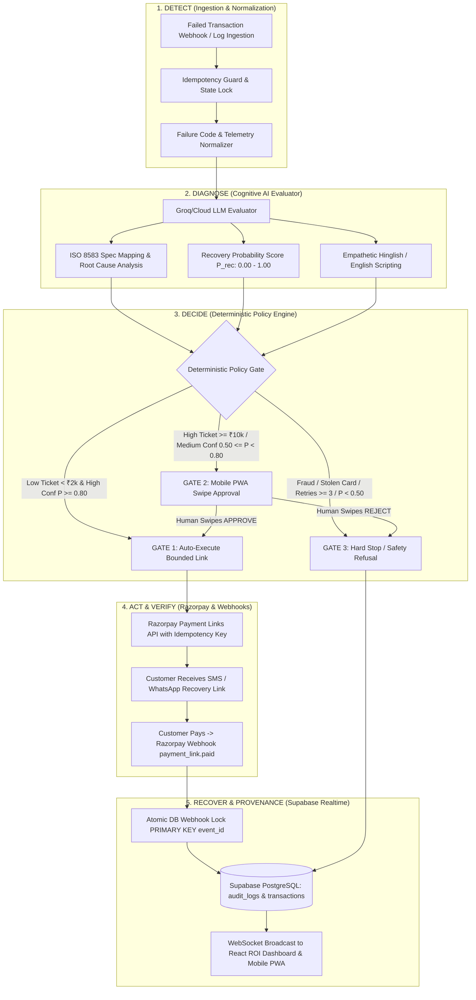

# Retrek — Autonomous AI Revenue Recovery Engine
### Razorpay Buildathon (Track 3) × iQOO Track 1 Grand Finale Submission

---

## 1. Executive Summary & Problem Alignment

Modern digital commerce loses substantial revenue not because customers want to leave, but because payments fail silently at the infrastructure, banking, or friction layer. Merchants closely monitor MRR, activation, and marketing CAC, while failed-payment recovery remains an unmonitored leak.

**Retrek** is an **Autonomous Revenue Operations & Dunning Engine** that closes the loop across:
$$\textbf{Detect} \longrightarrow \textbf{Diagnose} \longrightarrow \textbf{Decide} \longrightarrow \textbf{Act} \longrightarrow \textbf{Verify} \longrightarrow \textbf{Recover}$$

Built on a unified **100% Node.js Orchestrator** paired with **Supabase PostgreSQL Realtime**, Retrek combines **Cognitive LLM Diagnosis** with **Deterministic Safety Guardrails**, **Trust & Provenance Architecture**, and **Mobile-First Swipe Approvals** to recover at-risk revenue while guaranteeing zero financial risk, zero double-charges, and zero customer spamming.

---

## 2. System Architecture & Five-Stage Lifecycle



---

## 3. The 6 Standout Pillars (Trust, Safety & Industrial Rigor)

### Pillar 1: "AI Recommends, Deterministic Rules Decide" (Separation of Brain & Hands)
* **The Core Invariant:** The LLM is strictly an **Evaluator and Drafter**. It possesses **zero direct financial API credentials** and cannot move money or create links independently.
* **Deterministic Policy Gate:** All AI outputs must satisfy hard mathematical and logical boundaries in `policyEngine.js` before any financial SDK method is executed.

### Pillar 2: Safety-Critical Financial Guardrails & Deterministic Refusal Engine
* **Adversarial & Fraud Refusal:** If telemetry indicates `SUSPECTED_FRAUD`, `STOLEN_CARD`, blacklisted card fingerprints, or velocity spikes, the system triggers an immediate hard refusal (`RECOVERY_REFUSED_SAFETY_CRITICAL`), skipping all retries and outreach.
* **Stopping Rules:**
  * Strict limit: `retry_count >= 3` permanently terminates outreach.
  * Low recovery viability: `recovery_probability < 0.50` terminates recovery.
* **Bounded Exposure:**
  * Per-transaction caps: Tiered execution rules.
  * Global Daily Recovery Ceiling: Acts as a backend kill-switch against abnormal systemic surges.

### Pillar 3: Trust Architecture & Provenance Matrix
Every decision displays an unalterable **Provenance Trace** linking:
1. **ISO 8583 Banking Specification:** Maps cryptic gateway decline codes (e.g., `BANK_TIMEOUT_GATEWAY` $\rightarrow$ ISO-8583 Code 91 *System Error / Issuer Timeout*).
2. **Customer Behavioral Profile:** Past successful transactions, account age, dispute rate.
3. **Triggered Policy Rule ID:** Exact rule condition evaluated (e.g., `RULE_G2_HIGH_TICKET_THRESHOLD`).
4. **Verification & Audit Metadata:** Immutable JSONB record with model latency, token count, and confidence intervals.

### Pillar 4: Culturally Nuanced Hinglish & Multi-Channel Outreach
* Rather than robotic generic templates, Retrek drafts empathetic, non-pushy, context-aware messages in **natural Hinglish** (and fallback English).
* Adapts tone according to failure type:
  * *Bank 2FA Glitch:* "Hi Rahul, bank server me chhota sa issue aaya tha. Aap niche diye link se bina dobara details dale complete kar sakte hain."
  * *Card Expiry:* "Hi Priya, aapka card expire ho gaya hai. Tap karke new payment method update karein."
  * *Enterprise / High-Value:* Formal English invoice settlement link.

### Pillar 5: 2 AM Resilience — Duplicate Webhook Idempotency & Race-Condition Proofing
* **Webhook Race Conditions:** High-concurrency spikes often fire duplicate `payment_link.paid` webhooks within milliseconds.
* **PostgreSQL Atomic Lock:** Retrek stores incoming webhook event IDs in a `webhook_events` table with `PRIMARY KEY (event_id)`. If duplicate events arrive concurrently, PostgreSQL throws a unique constraint error, preventing duplicate recovery counting and acknowledging with `200 OK`.
* **Idempotent Link Dispatch:** Razorpay link creation attaches an idempotency hash built from `transaction_id + retry_count`.

### Pillar 6: Mobile-First Human-in-the-Loop (iQOO Track Synergy)
* High-ticket ($\ge \text{₹}10,000$) or borderline confidence ($0.50 \le P < 0.80$) cases are routed to a mobile PWA.
* **Tinder-Style Swipe-to-Approve:** Merchants swipe right to approve recovery or swipe left to terminate.
* Built mobile-first for smartphone touch interaction and mirrored seamlessly on desktop via **iQOO Office Kit**.

---

## 4. PostgreSQL Database Schema (Supabase)

```sql
-- 1. Transactions Ledger
CREATE TABLE transactions (
    id TEXT PRIMARY KEY,
    customer_name TEXT NOT NULL,
    customer_id TEXT,
    amount NUMERIC(12,2) NOT NULL,
    decline_code TEXT NOT NULL,
    retry_count INT DEFAULT 0,
    past_success_count INT DEFAULT 0,
    status TEXT CHECK (status IN ('FAILED', 'PENDING_APPROVAL', 'LINK_SENT', 'RECOVERED', 'STOPPED', 'REFUSED')) DEFAULT 'FAILED',
    created_at TIMESTAMP WITH TIME ZONE DEFAULT NOW(),
    updated_at TIMESTAMP WITH TIME ZONE DEFAULT NOW()
);

-- 2. Audit Trail & Provenance Ledger
CREATE TABLE audit_logs (
    id UUID DEFAULT gen_random_uuid() PRIMARY KEY,
    transaction_id TEXT REFERENCES transactions(id),
    decline_code TEXT NOT NULL,
    iso_code TEXT,
    recovery_probability NUMERIC(3,2),
    gate_decision TEXT CHECK (gate_decision IN ('AUTO_EXECUTE', 'HUMAN_APPROVAL', 'STOP_RULE', 'SAFETY_REFUSED')),
    rule_id TEXT NOT NULL,
    ai_reasoning JSONB NOT NULL,
    customer_message TEXT,
    execution_status TEXT,
    latency_ms INT,
    created_at TIMESTAMP WITH TIME ZONE DEFAULT NOW()
);

-- 3. Webhook Idempotency Lock Table
CREATE TABLE webhook_events (
    event_id TEXT PRIMARY KEY,
    event_type TEXT NOT NULL,
    payload JSONB NOT NULL,
    processed_at TIMESTAMP WITH TIME ZONE DEFAULT NOW()
);
```

---

## 5. Measured Value & Grand Finale Evaluation Suite

Rather than claiming qualitative success, Retrek is benchmarked using an automated evaluation harness across a batch of 50–100 synthetic and historical transactions:

| Evaluation Metric | Measured Benchmark Goal | Result / Impact |
| :--- | :--- | :--- |
| **Adversarial Safety & Fraud Refusal Rate** | **100% (0 Leaks)** | 0 fraud or blacklisted cases allowed to auto-retry. |
| **Audit Provenance Coverage** | **100%** | Every decision logged with ISO code, rule ID, and JSONB trace. |
| **Webhook Deduplication Rate** | **100%** | 0 double-counted recoveries during concurrency stress tests. |
| **Policy Evaluation Latency** | **< 50 ms** | Deterministic rule engine executes with zero perceptible lag. |
| **End-to-End Recovery Conversion** | **> 65% on recoverable failures** | Measured recovery of genuine technical/soft decline revenue. |

---

## 6. Five-Minute Grand Finale Pitch Strategy

1. **The Hook (0:00 - 0:45):** Highlight the $355 Indie Hackers case study—revenue slipping through unmonitored failed payment logs.
2. **The Architecture (0:45 - 1:45):** Explain "Brain vs. Hands" separation (Groq AI Evaluator + Deterministic Node.js Policy Engine + Supabase PostgreSQL).
3. **Live Interactive Demo (1:45 - 3:30):**
   - Ingest a batch failure event.
   - Show instant AI diagnosis & Hinglish message drafting.
   - Trigger a high-ticket transaction ($\text{₹}15,000$) $\rightarrow$ show live swipe card on iQOO smartphone mirrored via iQOO Office Kit $\rightarrow$ swipe right.
   - Razorpay test payment link generated and verified.
   - Live Supabase Realtime WebSocket push updating the ROI Dashboard without page refresh.
4. **2 AM Resilience & Safety (3:30 - 4:15):** Showcase PostgreSQL `PRIMARY KEY` webhook idempotency and safety refusal for fraud.
5. **Batch Benchmark & ROI (4:15 - 5:00):** Display total measured revenue recovered across the batch and conclude on production readiness.